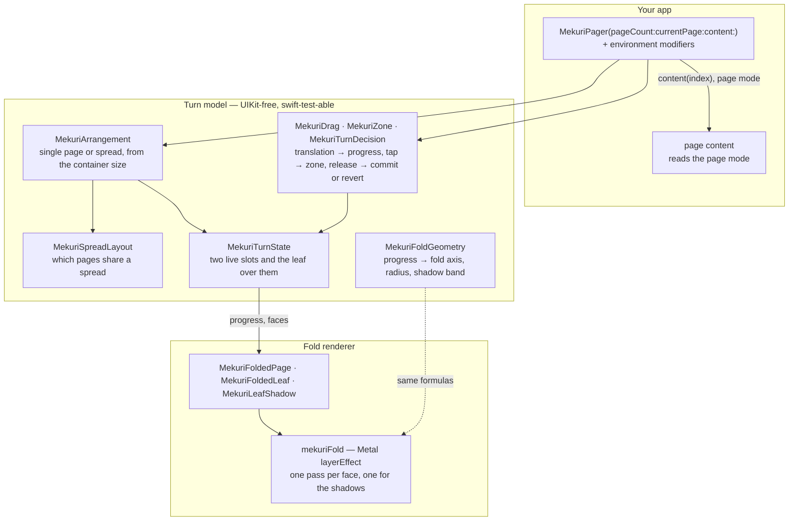

# Mekuri Architecture

Mekuri is a pure arithmetic core, a fold renderer per platform, and a pager
that composes them. The core is the part that must not drift between
platforms, so it is described once here and its constants are asserted equal
in both languages.



## The fold model

The sheet bends around a cylinder whose axis is parallel to the spine and
sweeps from the free edge (progress 0) to the spine (progress 1). Fold
distance is measured from the held end at the bottom of the page toward the
free corner at the top. Three things shape the crease:

- **Corner shear** moves the fold line horizontally per unit of vertical
  distance from the page centre, so the corner lifts before the edge. It is a
  ratio, never an angle, so it survives a change of page aspect.
- **Crease bow** lets the free corner run ahead of a straight crease by
  `creaseBow × pageWidth × p(1 − p)`, so the crease is straight again at both
  ends of the turn.
- **Radius opening** grows the cylinder radius along the fold from the held
  end, so the roll opens toward the corner the way a lifted sheet does.

Every pixel is classified by its signed distance `d` from the fold axis: past
the roll it shows the page beneath and the contact shadow; on the roll it
samples the front or the mirrored back at the unrolled distance and shades the
back by its normal against a fixed light; short of the crease it shows the
flat front, dimmed by the crease shadow. `MekuriFoldGeometry` holds the same
formulas in Swift and is what the tests exercise; the shader must match it.

| Constant | Value |
|---|---|
| `cylinderRadiusRatio` | 0.04 |
| `radiusOpening` | 1.0 |
| `creaseBow` | 0.35 |
| `cornerShear` | 0.10 |
| `backFaceDim` | 0.86 |
| `creaseShadowWidthRatio` | 0.10 |
| `creaseShadowOpacity` | 0.35 |
| `snapThreshold` | 0.35 |
| `flingVelocity` | 600 pt/s |
| `tapZoneRatio` | 0.25 |
| `settleAnimation` | spring, response 0.35, damping 0.86 |
| `minimumDoublePageWidth` | 275 pt |
| `landingFraction` / `landingFloor` | 0.12 / 0.01 |

The last row is the hinged leaf's landing: over the final twelfth of a spread
turn the roll and the shear flatten so the crease meets the spine, otherwise a
roll would stand on the spine at rest.

## The turn

A turn is described as what is on screen, not as a delta. `MekuriTurnState`
holds two live slots (`leading`, `trailing`) and a leaf with two faces
(`leafFront`, `leafBack`). Progress runs 0 to 1 in the turn's own direction;
a backward turn is the previous spread's forward leaf unfolding, so the fold
renderer reads `1 − progress` for it and the face roles swap. Single-page mode
is the degenerate spread: no leading slot, no back face, and the leaf's
reverse is its own front mirrored.

Phases: `dragging` follows every sample; `armed` inserts the leaf at rest and
starts the settle the moment the layer appears; `settling` animates progress
to 0 or 1 and commits or reverts on completion. A drag during a settle takes
it over from the presented progress, which the animatable modifier records
each frame.

### Spreads

`MekuriSpreadLayout` pairs pages. With the cover standing alone, spread 0
holds only page 0 in its trailing slot; otherwise pages pair from 0. A leaf is
the trailing page of the current spread with the leading page of the next on
its back. A spread holding one page is shifted so that page sits centred; the
shift runs from the departing spread's to the landing spread's with the
turn's progress, so slots and leaf slide as one piece. That offset is computed
inside the animatable modifier from the interpolated progress: a layer effect
renders its subtree at the model placement of an animated geometry modifier,
not the interpolated one.

### Selection

`currentPage` is the consumer's. A gesture turn writes the landing spread's
leading page (or its trailing page when the leading slot is absent). A change
from outside by exactly one page or spread curls; a larger jump crossfades; a
change within the shown spread moves nothing and is never written back, and a
curl the consumer caused lands on the page the consumer chose.

## Layering

Spread mode draws, in order: the leading slot, the trailing slot, the leaf's
shadows, then the leaf. Each face of the leaf is flattened into its own layer
before the shader runs, so translucent output composites exactly once, and the
shadow pass is a separate opaque layer beneath the leaf so neither shadow is
drawn twice. The shader folds a flap entering from the right only; a
right-to-left turn mirrors the layer on both sides of the effect.

## Cost

Measured on the demo in an iPad Pro 11-inch simulator (spread) and an iPhone
17 Pro simulator (single page), tap-driven turns, counting invocations of the
consumer's `content` closure, evaluations of the page body, and shader
constructions.

| | At rest | Single page, one turn | Spread, one turn |
|---|---|---|---|
| `content(index)` calls | 0 | 3 per face | 3 per face |
| Page body evaluations | 0 | 1–2 per page | 1–2 per page |
| Pages built outside the spread | 0 | 0 | 0 |
| `Shader` values | 0 | 1 per frame | 3 per frame (front, back, shadow) |

A `Shader` value is necessarily rebuilt every frame because progress is one of
its arguments; the shader function itself is resolved once. What a turn keeps
live, measured by heap snapshots of the demo on an iPad, is the leaf's two
faces — their text runs, display lists and attribute-graph storage — plus the
flattened layers for the three shader passes: about 5,000 objects and 0.6 MB
above the landed spread at rest, released when the leaf lands. A landed
spread itself rests about 1.3 MB above a lone cover because two pages are
live rather than one; that is the pages, not the turn. The first turn of a
process also pays the Metal function objects and Swift metadata once.
Further turns leave the rest heap within 9 KB of where it was, so nothing
accumulates. Before this was measured, the leaf's back face was
handed to the animatable modifier as a closure and rebuilt every frame of a
spread turn (one `content` call per frame, about 170 over a four-second
turn); it is now built once with the other faces, outside the modifier.

## Layout

```
Mekuri/
├── Package.swift     # at the root so the package can be consumed by URL; targets point into ios/
├── LICENSE
├── README.md
├── ARCHITECTURE.md
├── assets/           # the mark, light and dark
├── ios/
│   ├── Sources/Mekuri/
│   ├── Tests/MekuriTests/
│   └── Demo/         # a package cannot be an app, so the demo is its own project
└── android/          # its own Gradle build
```

One type per file, named for it. The Android module mirrors the same units
with the same names.
