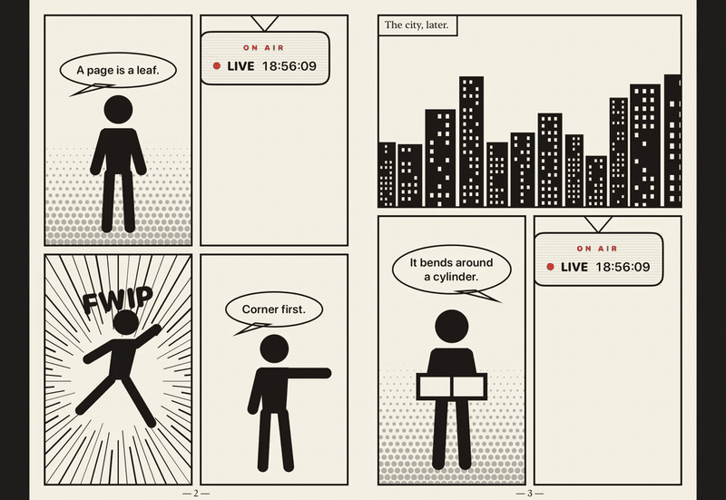

<p align="center">
  <picture>
    <source media="(prefers-color-scheme: dark)" srcset="assets/mekuri-dark.png">
    
  </picture>
</p>

<p align="center">
  
  <br>
  <a href="assets/mekuri-turn.mp4">mp4</a> — recorded from the demo on an iPad in landscape
</p>

# Mekuri

A page-curl pager for SwiftUI and Jetpack Compose. Pages turn the way paper does — the corner lifts, the sheet peels under the finger, the back face shows through — and the library knows nothing about what is drawn on those pages.

> **Why "Mekuri"?** Mekuru (めくる) is the Japanese verb for turning a page.

## What it does

- One page across the container, or a two-page spread with a real double-sided leaf when the container is wide enough.
- Left-to-right and right-to-left reading. Page indices are always in reading order; direction only decides which edge is the spine.
- Drag to peel, release to snap or spring back, tap an outer zone to turn, tap the centre to report to the consumer.
- Each page reads whether it is settled or being turned, so a video panel deep inside a page can stand itself down without any parent threading a flag.
- Reduce Motion honoured: a turn becomes a cut.
- Nothing is built outside the visible page or spread, and a settled pager evaluates nothing.

## Requirements

- iOS 18 / macOS 14, Swift 6.0. The fold is a Metal `layerEffect`; on macOS the package builds so `swift test` runs anywhere, and the fold renders on iOS.
- Android minSdk 33, Kotlin with Compose. The fold is an AGSL `RuntimeShader` applied as a render effect. The library is its own Gradle build under `android/`.

## Installation

Until the first tagged release, consume the package by path — the path is to your checkout of this repository, wherever it sits beside the consuming project:

```swift
dependencies: [
    .package(path: "../Mekuri")
]
```

`Package.swift` sits at the repository root — Swift Package Manager finds a manifest only there when a package is consumed by URL — and its targets point into `ios/`.

On Android, `android/` is a composite build; include it from the consuming build
and depend on the module it publishes, `app.mekuri:mekuri`:

```kotlin
// settings.gradle.kts — the path is to the android/ directory of your checkout
includeBuild(settingsDir.resolve("../Mekuri/android").normalize()) {
    name = "mekuri-android"
}
```

## SwiftUI

The initialiser takes only what a pager cannot exist without. Everything else is an environment-backed modifier that cascades from any ancestor.

```swift
import Mekuri

MekuriPager(pageCount: pages.count, currentPage: $index) { pageIndex in
    PageView(page: pages[pageIndex])       // reads @Environment(\.mekuriPageMode)
}
.mekuriDirection(.rightToLeft)
.mekuriPagingEnabled(!isZoomed)
.mekuriOnCenterTap { chromeHidden.toggle() }
```

Give the pager a background: a blocked turn at the first or last page lifts the page over whatever lies behind the pager.

### The page mode

```swift
struct PageView: View {
    @Environment(\.mekuriPageMode) private var mode

    var body: some View {
        switch mode {
        case .live:    LivePanel()          // playback, interaction
        case .turning: LastFrame()          // drawn from memory
        }
    }
}
```

Nothing is captured. The shader samples the face's live rendered content every frame, on both platforms, so **the turning view must be static for as long as the turn lasts**. Draw it from what is already in memory. Anything that resolves mid-turn — a placeholder that fills in, an image that finishes loading, an animation still running — re-renders inside the fold, and the reader sees the sheet change under the finger.

### Selection

`currentPage` is the consumer's. A turn writes it when the leaf lands. Setting it from outside curls to a neighbouring page or spread and crossfades to anything further away; setting it to the other page of the spread already on screen moves nothing and is never written back.

### Spreads

```swift
.mekuriSpread(.automatic)          // .automatic, .single, .double
.mekuriCoverStandsAlone(true)      // page 0 opens alone in the trailing slot
.mekuriPageAspectRatio(2.0 / 3.0)  // width over height of one page
```

Under `.automatic` two pages appear when both fit the container at the page aspect and each is at least 270 points wide. That is a readability floor, not a device test, and what reaches it is the page shape and the container's height rather than the device class: at the default 2/3 aspect a container has to be 405 points tall before each page clears the floor, so larger phones in landscape spread and smaller ones stay single, and a narrower page shape needs a taller container still. For page shapes at least half as wide as tall the floor never decides a portrait container, because two pages cannot fit its width in the first place. A spread holding one page (the cover, or a lone last page) sits centred and slides into its slot as the first turn begins.

### Modifiers

| Modifier | Default | Meaning |
|---|---|---|
| `mekuriDirection(_:)` | `.leftToRight` | Which edge is the spine |
| `mekuriPagingEnabled(_:)` | `true` | Off: drags and edge taps are ignored, centre taps still report |
| `mekuriOnCenterTap(_:)` | none | Called for a tap in the centre zone |
| `mekuriSpread(_:)` | `.automatic` | One page or two |
| `mekuriCoverStandsAlone(_:)` | `true` | Page 0 alone in the trailing slot |
| `mekuriPageAspectRatio(_:)` | `2/3` | Width over height of one page |
| `mekuriFoldRadius(_:)` | `0.04` | Cylinder radius as a ratio of page width |
| `mekuriCornerLift(_:)` | `0.10` | Fold-line travel per unit of vertical distance from the page centre |
| `mekuriCreaseBow(_:)` | `0.35` | How far the free corner runs ahead of a straight crease, 0…1 |
| `mekuriTapZone(_:)` | `0.25` | Width of each edge tap zone as a ratio of page width |
| `mekuriSnapThreshold(_:)` | `0.35` | Progress past which a release completes the turn |
| `mekuriSettleAnimation(_:)` | `nil` | Settle animation; `nil` is the package spring |
| `mekuriReducedMotion(_:)` | `nil` | Override the system setting either way; `nil` follows it |

## Jetpack Compose

Compose has no cascading modifier for arbitrary values, so the Compose API mirrors the concepts rather than the syntax: everything that is a modifier on iOS is a parameter with a default here. The page mode arrives through a composition local so a deep child can read it, exactly as on iOS.

```kotlin
val state = rememberMekuriPagerState(pageCount = pages.size, direction = MekuriDirection.RightToLeft)

MekuriPager(
    state = state,
    configuration = MekuriConfiguration(creaseBow = 0.6f),
    pagingEnabled = !isZoomed,
    onCenterTap = { chromeHidden = !chromeHidden },
    spread = MekuriSpread.Automatic,
    coverStandsAlone = true,
    pageAspectRatio = 2f / 3f,
) { pageIndex ->
    PageContent(page = pages[pageIndex])   // reads LocalMekuriPageMode.current
}

state.animateToPage(n)
```

`MekuriPagerState` carries the selection. `currentPage` follows the page on screen; `animateToPage` curls to its target and `scrollToPage` cuts to it, and a `scrollToPage` arriving mid-turn cancels a pending `animateToPage`. A turn the user grabs and pushes back returns from `animateToPage` normally, with the settled page, rather than throwing. `rememberMekuriPagerState` saves the page across a configuration change.

To hold the state outside composition — in a view model, say — build it directly with the page count as a function, the way Compose's own pager state takes it, so a book that loads its pages later still reports them:

```kotlin
val state = MekuriPagerState(pageCount = { book.pages.size })
```

The fold and gesture knobs live on `MekuriConfiguration`, whose public constructor takes `foldRadius`, `cornerLift`, `creaseBow`, `tapZone`, `snapThreshold`, `settleAnimation` and `reducedMotionOverride` — the same seven the SwiftUI modifiers expose. `settleAnimation` is a Compose `AnimationSpec` and is the one value deliberately not held in parity with iOS; the two animation systems have no shared representation, so the feel is matched by eye and the numbers are not asserted equal.

## Accessibility

The pager is a single element that contains its pages. It exposes the settled page as a value — `Page 3 of 12` — and two actions that turn with the same fold a tap gives: a SwiftUI adjustable action, incrementing forward and decrementing back, and on Compose custom actions named `Next page` and `Previous page`. With paging off the value stays and the actions go, on both platforms.

Those strings are English literals in the library and there is no way to override them. A reader in another language reads its own pages and an English page count.

## The fold

The sheet bends around a cylinder whose axis is parallel to the spine and travels across the page as the turn progresses; the corner lifts before the edge, and the crease bows. Progress runs 0 at rest to 1 at a completed turn. The same constants produce the same numbers on both platforms.

| Constant | Value | Meaning |
|---|---|---|
| `cylinderRadius` | `0.04 × pageWidth` | Radius at the held end; tighter reads as thin paper, wider as card |
| `radiusOpening` | `1.0` | Growth of the radius per page width of fold distance from the held end |
| `cornerShear` | `0.10` | Horizontal travel of the fold line per unit of vertical distance from the page centre |
| `creaseBow` | `0.35` | How far the free corner runs ahead of a straight crease |
| `backFaceDim` | `0.86` | Darkest brightness of the lit reverse of the sheet |
| `creaseShadowWidth` | `0.10 × pageWidth` | Shadow band cast along the fold onto the page below |
| `creaseShadowOpacity` | `0.35` | Peak opacity of that band |
| `snapThreshold` | `0.35` | Progress past which a release completes the turn |
| `flingVelocity` | `600 pt/s` | Velocity past which a release completes regardless of progress |
| `settleAnimation` | spring, response `0.35`, damping `0.86` | Completion and spring-back |
| `tapZoneWidth` | `0.25 × pageWidth` | Outer zone on each side; the middle half is the centre zone |
| `minimumDoublePageWidth` | `270 pt` | Narrowest single page at which `.automatic` lays out a spread |

Six of these are the modifiers above: `cylinderRadius`, `cornerShear`, `creaseBow`, `snapThreshold`, `settleAnimation` and `tapZoneWidth`. Radius opening, back-face dimming, the crease shadow and the fling velocity keep their tuned values. [ARCHITECTURE.md](ARCHITECTURE.md) describes how the fold is drawn and what a turn costs.

## Demo

`ios/Demo/MekuriDemo.xcodeproj` is a six-page comic drawn in code, with every modifier on a control. It keeps the default 2/3 page shape, so what rotation does depends on the device: an iPhone 17 Pro simulator is 402 points tall in landscape, which puts a page at 268 points and holds it single in both orientations, while an iPad spreads in landscape and stays single in portrait, where two pages miss the width by nearly half. The Spread control forces `.double` if you want the two-page layout on a phone regardless. The fourth and fifth pages are one composition that runs across the spine. Each page carries a clock that keeps ticking on a settled page and freezes on the face being turned.

The controls float over the page and a tap in the centre zone shows or hides them. **Presentation** turns off the harness affordances — the edge letters, the per-page button and the counter — and hides the status bar, leaving the page edge to edge; the centre tap still brings the controls back. It is off by default because those affordances are how the gesture-precedence checks are driven.

`android/demo` is the same comic in Compose: `cd android && ./gradlew :demo:installDebug`. It keeps the same 2/3 page shape. A 1080 x 2400 emulator at its native 420 dpi is 411 dp tall in landscape, which puts a page at 274 dp: single in portrait, a spread when rotated. A shorter phone stays single in landscape too; a tablet spreads in landscape and stays single in portrait.

## Tests

From the root of this repository:

```bash
swift test
cd android && ./gradlew :mekuri:check
```

The geometry, the turn model and the spread layout are UIKit-free, so the Swift suite runs on macOS without a simulator, and the Kotlin unit tests are plain JVM tests. `MekuriParityTests.swift` and `MekuriParityTest.kt` assert the same literal expected values on both sides, to an absolute tolerance of 1e-3 at page scale, so a constant that drifts in one language fails there rather than both moving together. The fold itself is verified by running the demos.

## Out of scope

Deliberately absent, and not planned:

- **Page content of any kind.** The library never loads, decodes or caches an image. A page is a closure the consumer writes, and the library only asks it for an index.
- **Zoom and pan.** A pinch-to-zoom reader wraps the pager and stands paging down with `mekuriPagingEnabled(false)` / `pagingEnabled = false` while it is zoomed.
- **Vertical and continuous-scroll reading modes.** The fold is a horizontal page turn and nothing else.
- **Chrome.** Page counters, thumbnails, a scrubber and a table of contents are the consumer's, and the demos show one way to build them.
- **Publishing to a registry.** Consume by path, or by an included Gradle build, until there is a tagged release.

## Licence

MIT — see [LICENSE](LICENSE).
